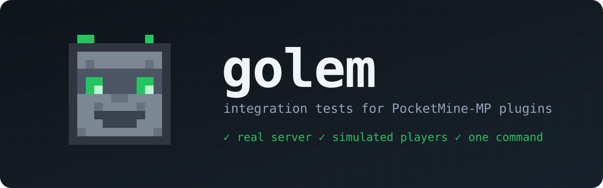
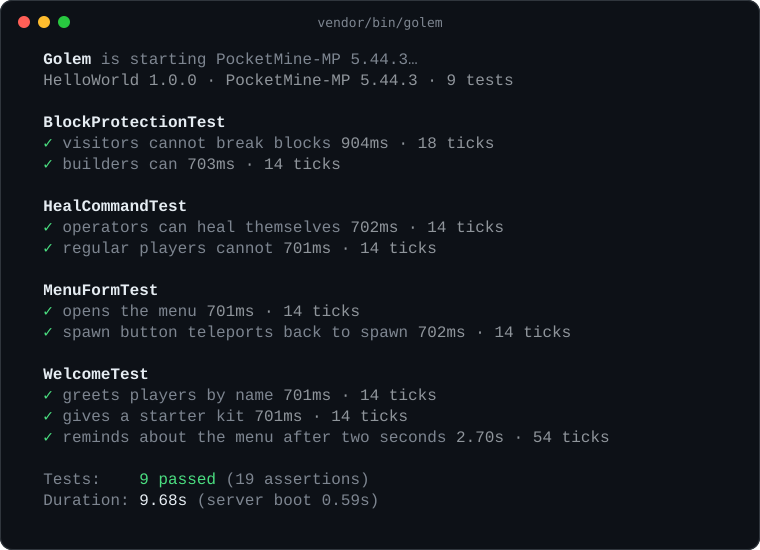
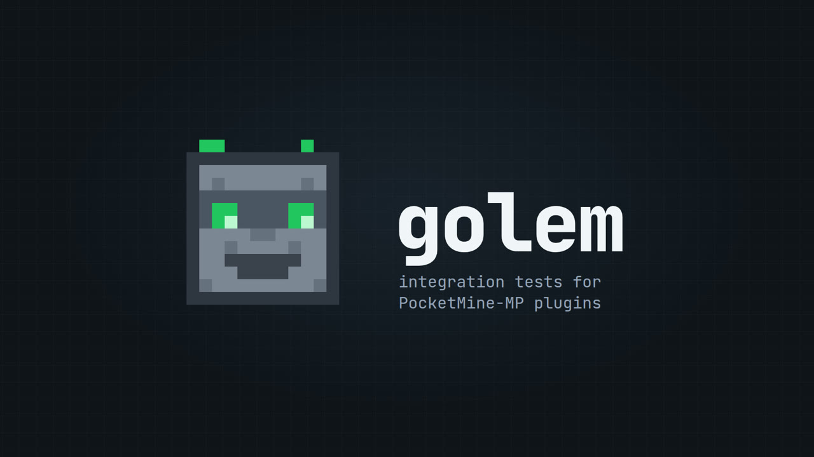
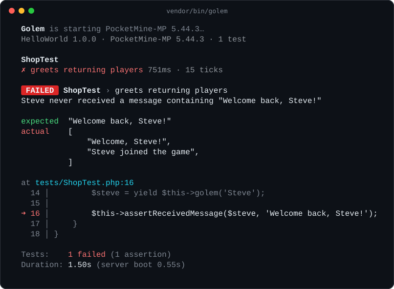

<p align="center">
  
</p>

<p align="center">
  <a href="https://github.com/achedon12/golem/actions/workflows/ci.yml"></a>
  <a href="https://github.com/achedon12/golem/releases"></a>
  
  
  
  <a href="LICENSE"></a>
  <a href="https://achedon12.github.io/golem/"></a>
  <a href="https://packagist.org/packages/achedon12/golem"></a>
</p>

**Golem** tests your PocketMine-MP plugin the way your players use it. One command boots a real
server, loads your plugin from source, spawns simulated players (*golems*) that join, chat, run
commands, click forms and break blocks, then checks what happened. No mocks, no client, no manual
testing on a local server ever again.

```php
final class WelcomeTest extends TestCase
{
    public function testGreetsPlayersByName(): Generator
    {
        $steve = yield $this->golem('Steve');      // a real Player joins the server

        $this->assertReceivedMessage($steve, 'Welcome, Steve!');
        $this->assertHasItem($steve, VanillaItems::BREAD(), 3);
    }

    public function testMenuTeleportsToSpawn(): Generator
    {
        $steve = yield $this->golem('Steve');
        $steve->teleport($this->spawn()->add(40, 0, 40));

        $steve->chat('/menu');
        $steve->clickButton('Spawn');               // answer the form like a player would

        $this->assertAt($steve, $this->spawn());
    }
}
```

<p align="center">
  
</p>

<p align="center">
  <a href="https://github.com/achedon12/golem/releases/download/v0.1.0/golem-intro.mp4">
    <br>
    <sub>▶ Watch the 20-second intro</sub>
  </a>
</p>

## Why Golem

Unit tests stop where PocketMine starts: events, permissions, forms, inventories, scheduling and
worlds all need a running server. So most plugins are tested by hand, by joining a local server
and trying things. Golem automates exactly that:

- **A real server.** Your plugin runs on the PocketMine-MP version you choose, with every event
  fired in the real order. If it works in Golem, it works in production.
- **Simulated players.** Golems are genuine `Player` objects behind a fake network session. They
  go through login and spawn, so `PlayerJoinEvent` and friends fire exactly as usual.
- **Time is a first-class citizen.** `yield $this->wait(20)` lets a second pass; `waitUntil()` polls
  a condition tick by tick. Cooldowns, delayed tasks and async work are testable.
- **Zero setup.** Golem downloads the official PocketMine PHP build and server phar, caches them,
  and creates a fresh world for every run.
- **Made for CI.** JUnit reports, a one-line GitHub Action, and failures annotated right on the
  pull request diff.

## Installation

```bash
composer require --dev achedon12/golem
vendor/bin/golem init      # adds tests/ExampleTest.php and a GitHub Actions workflow
vendor/bin/golem           # runs your tests
```

Golem needs PHP 8.1+ on your machine to run the CLI, on Linux or macOS (on Windows, use WSL).
The server itself runs on PocketMine's own PHP build, which Golem downloads once.

Composer is only there to give your IDE autocompletion. The CLI has no dependencies, so you can
also clone this repository and run `php path/to/golem/bin/golem` from your plugin folder.

## Writing tests

Tests live in `tests/` next to your `plugin.yml`. Each public method starting with `test` runs on
the server's main thread, after your plugin is enabled. A test that needs time to pass is a
generator: yield what you are waiting for and Golem resumes the test when it is ready.

```php
public function testHealCooldown(): Generator
{
    $steve = yield $this->golem('Steve');
    $steve->op()->player()->setHealth(4);

    $steve->chat('/heal');
    $steve->player()->setHealth(4);
    $steve->chat('/heal');
    $this->assertHealth($steve, 4);                // still on cooldown

    yield $this->wait(5 * 20);                      // five seconds later...
    $steve->chat('/heal');
    $this->assertHealth($steve, 20);
}
```

| A golem can | Then you can check |
| --- | --- |
| `chat()`, `command()` | `messages()`, `titles()`, `actionBars()`, `tips()`, `popups()`, `toasts()` |
| `clickButton()`, `submitForm()`, `closeForm()` | `form()`, `formData()` |
| `clickSlot()`, `closeWindow()` in chest menus (InvMenu works) | `window()` |
| `walkTo()`, `walk()`, `jump()`, `sneak()`, `sprint()` | `position()`, fall damage, `PlayerMoveEvent` in your plugin |
| `breakBlock()`, `interactBlock()`, `interactEntity()`, `useItem()`, `attack()` | `scoreboard()`, `bossBar()`, `sounds()` |
| `op()`, `grant()`, `gamemode()`, `teleport()`, `give()`, `hold()`, `respawn()`, `quit()` | `disconnectReason()`, `packets()`, and `player()` for the full PocketMine API |

On top of the usual `assertSame`, `assertTrue`, `assertCount`… you get Minecraft-aware assertions:
`assertReceivedMessage`, `assertTitle`, `assertFormOpen`, `assertWindowOpen`, `assertScoreboardContains`,
`assertBossBar`, `assertSoundPlayed`, `assertHasItem`, `assertHealth`, `assertAt`, `assertBlockAt`,
`assertKicked`, `assertDead` and more.

Tests can run in a throwaway world (`#[FreshWorld]`) or a copy of your map (`#[World('tests/worlds/arena')]`),
take data sets (`#[DataProvider]`), and plugins using virions just work: Golem reads your `.poggit.yml`.
Keep `vendor/bin/golem --watch` open while you code to re-run everything on each save.

When something breaks, Golem tells you what it expected, what it got, and where:

<p align="center">
  
</p>

## On a development server

Golem is also a plugin: put [`Golem.phar`](https://github.com/achedon12/golem/releases/latest/download/Golem.phar) in your dev server's
`plugins/` folder and spawn simulated players by hand, to try a minigame or a duel alone:

```text
/golem spawn Rival
/golem Rival chat /duel accept
/golem Rival inbox
```

See [Server plugin](https://achedon12.github.io/golem/server-plugin) for every command.

## Fuzzing

`golem fuzz` has golems do random things to your plugin for a minute (commands with odd
arguments, invalid form answers, clicks, disconnections) and reports every exception with the
actions that led to it and a seed to replay them. See [Fuzzing](https://achedon12.github.io/golem/fuzzing).

## Benchmark

`golem bench --players=100` brings golems in a few at a time and shows how TPS, tick usage and
memory evolve, then the plugin's slowest listeners. `assertTpsAbove(18.0)` catches a slowdown in a
test. See [Benchmark](https://achedon12.github.io/golem/benchmark).

## Continuous integration

```yaml
# .github/workflows/tests.yml
name: Tests
on: [push, pull_request]

jobs:
  golem:
    runs-on: ubuntu-latest
    steps:
      - uses: actions/checkout@v7
      - uses: achedon12/golem@v0
```

The action caches PocketMine between runs, writes `golem-junit.xml`, and annotates failures on
the pull request. See [docs/ci.md](docs/ci.md) for the options and for other CI systems.

## Documentation

📖 **[achedon12.github.io/golem](https://achedon12.github.io/golem/)**, with search. The same pages are
in the [wiki](https://github.com/achedon12/golem/wiki) and in [`docs/`](docs):

- [Getting started](https://achedon12.github.io/golem/getting-started)
- [Writing tests](https://achedon12.github.io/golem/writing-tests): structure, waiting, setUp, attributes
- [Golems](https://achedon12.github.io/golem/golems): everything a simulated player can do
- [Assertions](https://achedon12.github.io/golem/assertions): the full list
- [Configuration](https://achedon12.github.io/golem/configuration): CLI options and `composer.json` settings
- [Continuous integration](https://achedon12.github.io/golem/ci)
- [How it works](https://achedon12.github.io/golem/how-it-works), including the current limitations

## Status

Golem is young (0.x): the API may still change between minor versions, and the
[changelog](CHANGELOG.md) will say so. It targets PocketMine-MP 5, which reached its end of support
in July 2026, and **its forks**: `--pocketmine=owner/repository` tests your plugin on the fork your
server runs (see [forks](https://achedon12.github.io/golem/configuration#pocketmine-mp-forks)). Ideas, bug reports and pull
requests are very welcome, see [CONTRIBUTING.md](CONTRIBUTING.md).

## License

[MIT](LICENSE) © Achedon12
